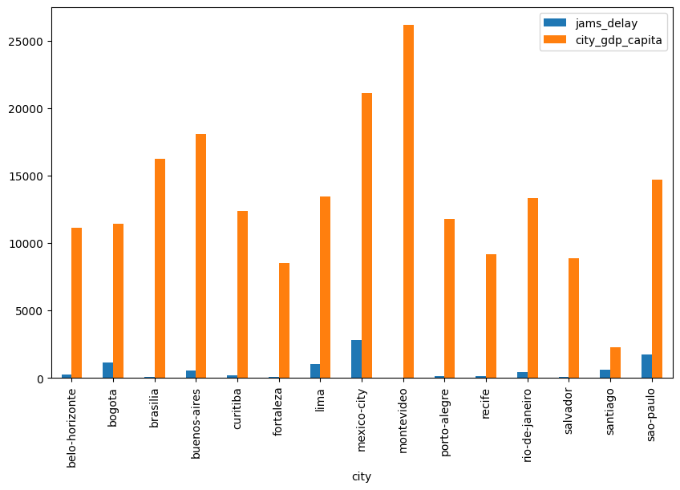

# 🏙️ Urban Mobility & Economic Productivity in LATAM (2024)

## Project Overview
This project evaluates the relationship between traffic congestion and economic output across major Latin American cities. Using real-world data from the **TomTom Traffic Index** and **OECD Economic Reports**, I analyzed whether road saturation acts as a bottleneck for regional productivity.

## 📊 Key Findings
- **The Mobility-GDP Gap:** No strong linear correlation was found between GDP growth and traffic saturation, suggesting that infrastructure efficiency varies wildly regardless of wealth.
- **Top Performer (Montevideo):** Uruguay’s capital stands out as the most efficient city, maintaining the highest GDP per capita with the lowest congestion levels.
- **Critical Saturation (CDMX & São Paulo):** Mexico City has the highest traffic delays despite high productivity.
- **Investment Opportunity:** **São Paulo** was identified as the primary candidate for transport infrastructure investment due to its high economic weight and critical traffic saturation levels.

## 🛠️ Tools & Libraries
- **Python (Pandas):** Data cleaning and manipulation.
- **Matplotlib & Seaborn:** Statistical data visualization.
- **Scipy:** Correlation analysis and outlier detection.

## 📁 Repository Structure
- `data/`: Cleaned dataset with TomTom and OECD features.
- `notebooks/`: Full analysis process, including data cleaning and visualization.
- `visuals/`: Key charts exported for quick reference.

## 🚀 How to Run
1. Clone this repo: `git clone [YOUR_REPO_URL]`
2. Install dependencies: `pip install -r requirements.txt`
3. Open the notebook in `notebooks/` to view the analysis.
